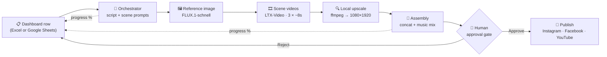

<div align="center">

# 🎬 AI Social Media Content Automation

**An end-to-end, AI-orchestrated pipeline that turns a single row in a spreadsheet into a finished short-form video — generated, assembled, approved by a human, and published to Instagram, Facebook and YouTube.**

[](https://github.com/itzmoksh01/AI-Social-Media-Content-Automation/actions/workflows/generate.yml)
[](https://github.com/itzmoksh01/AI-Social-Media-Content-Automation/actions/workflows/publish.yml)


</div>

---

## ✨ What it does

Write a title and description in the dashboard → the pipeline writes the script and scene prompts, generates a character reference image, animates every scene, upscales, stitches, mixes music, and reports progress back to the dashboard in real time. A human approves the result, and only then does it publish — automatically — to **Instagram Reels, Facebook and YouTube Shorts**.

Two generation engines are supported:

| Engine | Status | Cost | Models |
|---|---|---|---|
| **Hugging Face** (`scripts/hf_*.py`) | ✅ Current default | **100% free** (ZeroGPU quota) | FLUX.1-schnell (images) · LTX-Video distilled (video) |
| Higgsfield (`scripts/higgsfield_scene.py`) | Legacy fallback | Paid credits | Higgsfield CLI |

## 🔁 Pipeline



**Design principles**

- **Human-in-the-loop, always.** Nothing publishes without an explicit approval.
- **Secrets never touch the repo.** All tokens live in `config/.env` (gitignored); the repo ships only `config/.env.example`.
- **Graceful degradation.** A missing platform token skips that platform instead of failing the run.
- **Runs anywhere.** Locally with an AI assistant as the orchestration brain, or unattended in GitHub Actions (`.github/workflows/`).

## 🚀 Quick start

```bash
git clone https://github.com/itzmoksh01/AI-Social-Media-Content-Automation.git
cd AI-Social-Media-Content-Automation

python -m venv .venv
source .venv/bin/activate        # Windows: .venv\Scripts\activate
pip install -r requirements.txt

cp config/.env.example config/.env   # fill in your tokens (see below)
```

**Prerequisites:** Python 3.11+, [ffmpeg](https://ffmpeg.org/) on PATH. A free [Hugging Face](https://huggingface.co) account is enough for the default engine — no paid API is required.

### Run a video from the Excel dashboard

```bash
python scripts/create_excel_dashboard.py   # (re)build dashboard.xlsx
# → add/edit a content row, set its Status to "Pending"
python scripts/excel_sync.py claim         # claim the next Pending row
# → the orchestrator generates scenes per config/engine.json,
#   reporting progress back into the sheet as it goes
python scripts/publish.py --run <run_folder>   # after approval only
```

Step-by-step account setup (Hugging Face token, Instagram / Facebook / YouTube) lives in **[docs/ACCOUNT_SETUP_STEPS.md](docs/ACCOUNT_SETUP_STEPS.md)**, and the full demo procedure in **[docs/DEMO_RUNBOOK.md](docs/DEMO_RUNBOOK.md)**.

## ⚙️ Configuration

| File | Purpose |
|---|---|
| `config/.env` | Your real tokens (**never committed** — start from `config/.env.example`) |
| `config/engine.json` | Active engines, input source, free-tier limits, caption & approval settings |
| `config/theme.json` | Channel niche, tone and content pillars |
| `config/characters/*.md` | Recurring-character bibles (identity, look, voice, wardrobe rules) |
| `dashboard.xlsx` | The Excel control plane: content rows, status, progress %, run links |

**Key `.env` variables:** `HF_TOKEN` (Hugging Face Read token) · `INSTAGRAM_ACCESS_TOKEN` + `INSTAGRAM_BUSINESS_ACCOUNT_ID` · `FACEBOOK_PAGE_ID` + `FACEBOOK_PAGE_ACCESS_TOKEN` · `YOUTUBE_TOKEN` (OAuth JSON from `scripts/youtube_oauth_setup.py`).

## 📂 Project structure

```
├── .github/workflows/     # CI: generate.yml (produce + request approval)
│                          #     publish.yml (publish on approval)
├── apps_script/           # Google Apps Script bridge (Sheets mode)
├── assets/music/          # Royalty-free music library, by mood
├── config/                # engine.json · theme.json · characters/ · .env.example
├── docs/                  # Architecture, setup guides, runbooks
├── scripts/
│   ├── hf_common.py · hf_image.py · hf_scene.py   # Free Hugging Face engine
│   ├── higgsfield_scene.py                        # Legacy paid engine
│   ├── excel_sync.py · sheets_sync.py             # Dashboard control planes
│   ├── create_excel_dashboard.py                  # Builds dashboard.xlsx
│   ├── generate.py                                # Generation orchestrator
│   ├── upscale_local.py · concat_clips.py · mix_music.py · burn_caption.py
│   ├── approval_server.py · send_approval_email.py
│   └── publish.py                                 # Instagram · Facebook · YouTube
├── CLAUDE.md              # Creative + operational instructions for the AI brain
├── context.md             # Living project snapshot: what's built, what's left
└── rules.md               # Production rules template (duration, ratio, storyboard)
```

Generated media lives under `storage/` (gitignored) — the repo stays source-only and lightweight.

## 📚 Documentation

| Doc | What's inside |
|---|---|
| [docs/AUTOMATION_ARCHITECTURE.md](docs/AUTOMATION_ARCHITECTURE.md) | Full system architecture |
| [docs/ACCOUNT_SETUP_STEPS.md](docs/ACCOUNT_SETUP_STEPS.md) | Every account & token, step by step |
| [docs/DEMO_RUNBOOK.md](docs/DEMO_RUNBOOK.md) | The live-demo procedure, end to end |
| [docs/GITHUB_NATIVE_SHEETS_SETUP.md](docs/GITHUB_NATIVE_SHEETS_SETUP.md) | Google Sheets + GitHub Actions mode |
| [context.md](context.md) | Current status, decisions and deviations |

## 🗺️ Status

- ✅ Excel-dashboard control plane with live progress sync
- ✅ Free Hugging Face generation engine (FLUX + LTX-Video) with local 1080×1920 upscale
- ✅ Human approval gate; Instagram, Facebook Page and YouTube publishing wired
- ✅ Google Sheets mode + GitHub Actions workflows (original pipeline)
- 🔜 Connect production social accounts (tokens via `config/.env`) and finalise `config/theme.json`

## 👤 Author

**Abhishek Goswami** — Generative AI Specialist
[LinkedIn](https://www.linkedin.com/in/itzabhishek) · itzmoksh01@gmail.com

## 📄 License

Released under the [MIT License](LICENSE).
